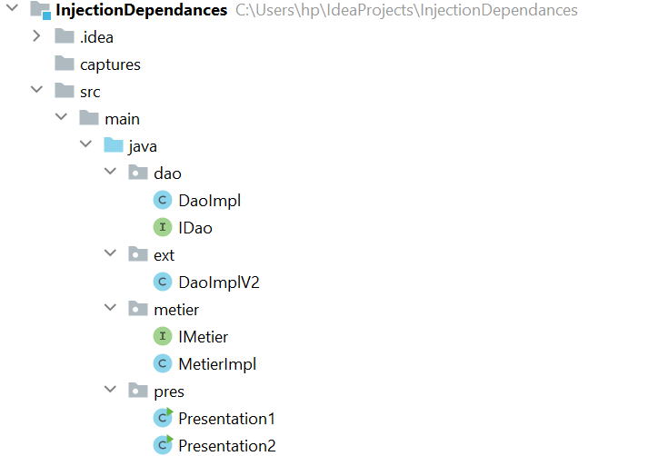
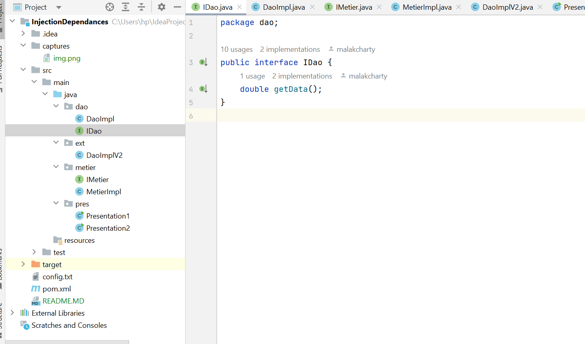
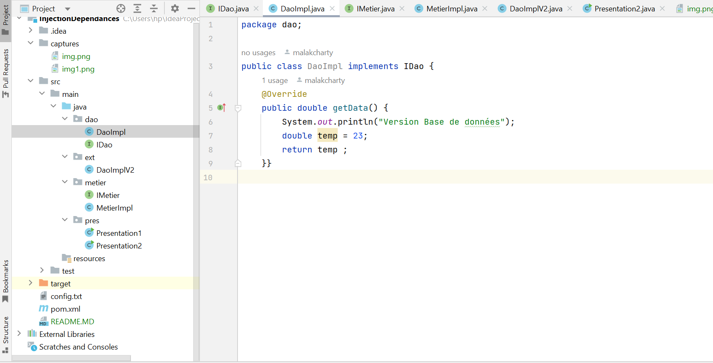
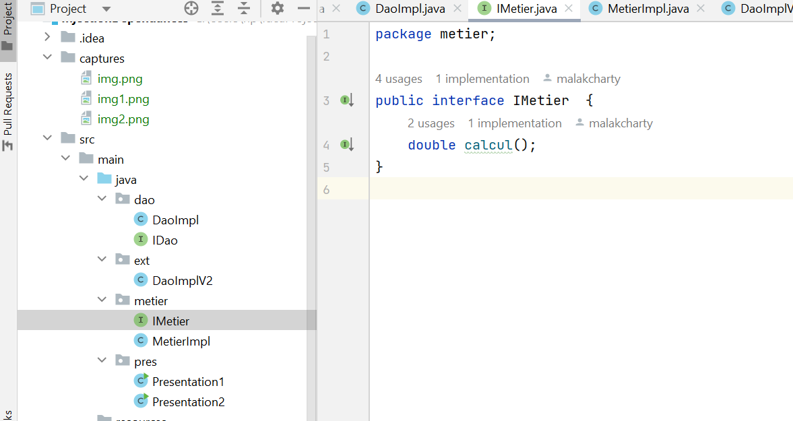
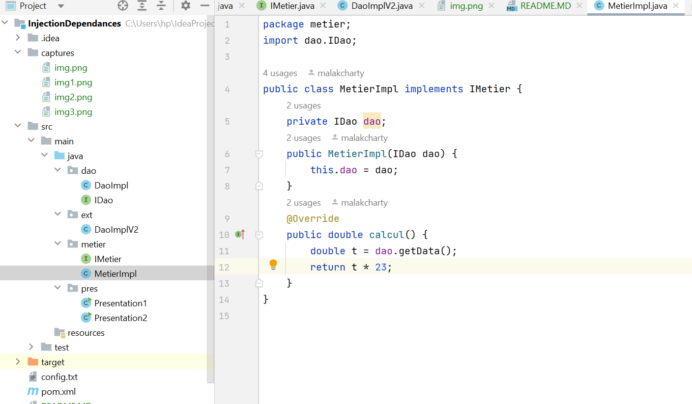
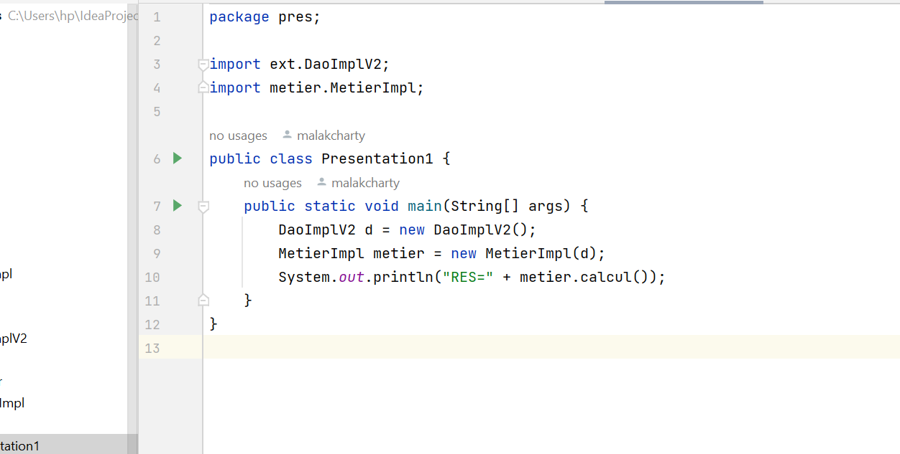
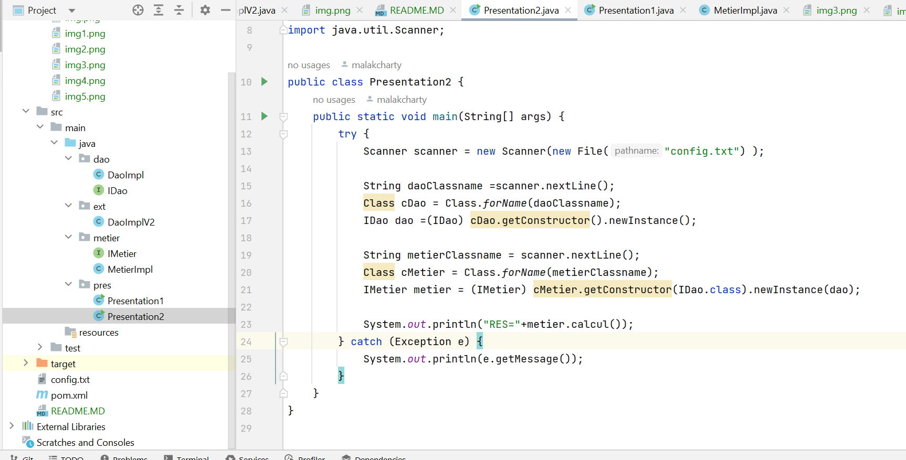
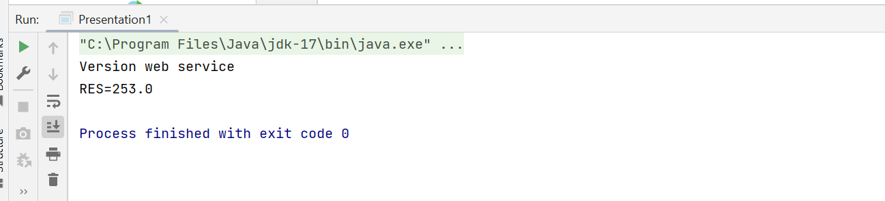
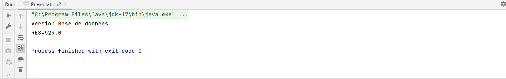

<h3>Compte rendu activite </h3>
<h4>voici l'architecture de mon projet</h4>

<h4>voici l'interface IDao avec une méthode getData</h4>

<h4>voici l'implémentation de cette interface </h4>

<h4>voici l'interface IMetier avec une méthode calcul </h4>

<h4>voici une implémentation de cette interface en utilisant le couplage faible </h4>

<h4>voici l'injection des dépendances :Par instanciation statique </h4>

<h4>voici l'injection des dépendances :Par instanciation dynamique </h4>

<h4>Sortie version web service </h4>

<h4>Sortie version base de donnees </h4>
