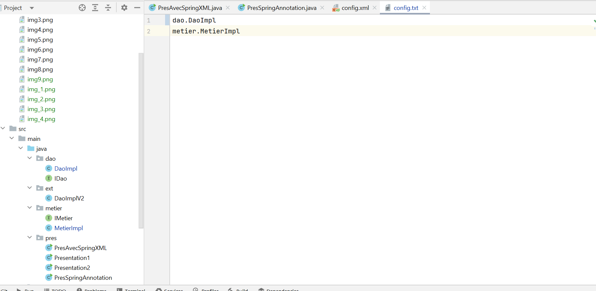

<h3>Compte rendu  de l'Activité Pratique N°1- Injection des dépendances </h3>
<h4>Voici l'architecture de mon projet</h4>

<h4>Voici le diagramme de classe de mon projet</h4>

<h4>Voici l'interface IDao avec une méthode getData</h4>

<h4>Voici l'implémentation de cette interface </h4>

<h4>Voici l'interface IMetier avec une méthode calcul </h4>

<h4>Voici une implémentation de cette interface en utilisant le couplage faible </h4>

<h4>Voici l'injection des dépendances :Par instanciation statique </h4>

<h4>Voici l'injection des dépendances :Par instanciation dynamique </h4>

<h4> Voici mon fichier config.txt pour sortie base de donnees</h4>

<h4>Sortie version base de donnees </h4>

<h4> Voici mon fichier config.txt pour sortie web service</h4>

<h4>Sortie version web service </h4>

<h4>Voici l'injection des dépendances :En utilisant le Framework Spring</h4>
<h4> a-Version XML </h4>

<h4> b-Version Annotations</h4>

<h4> Voici mon fichier config.xml</h4>

<h4> Voici mon fichier pom.xml</h4>

